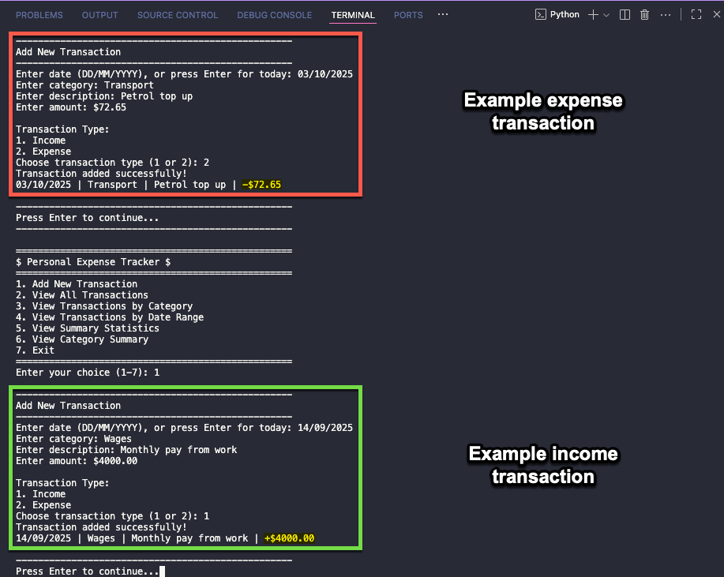
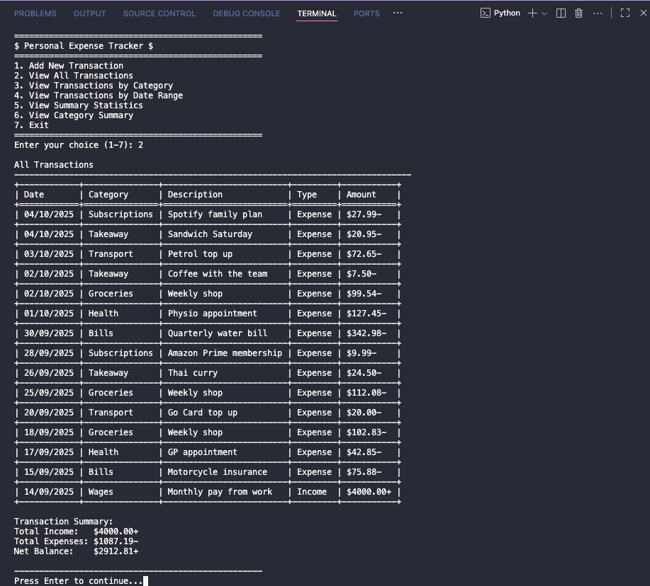
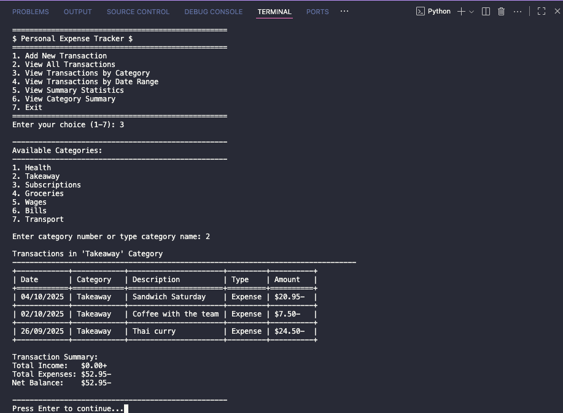
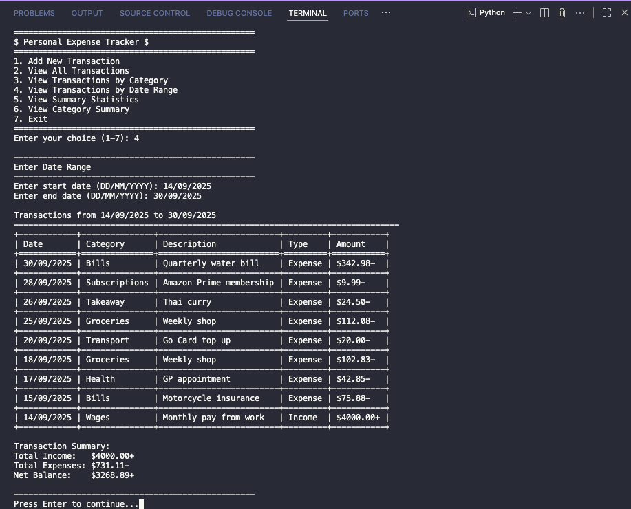
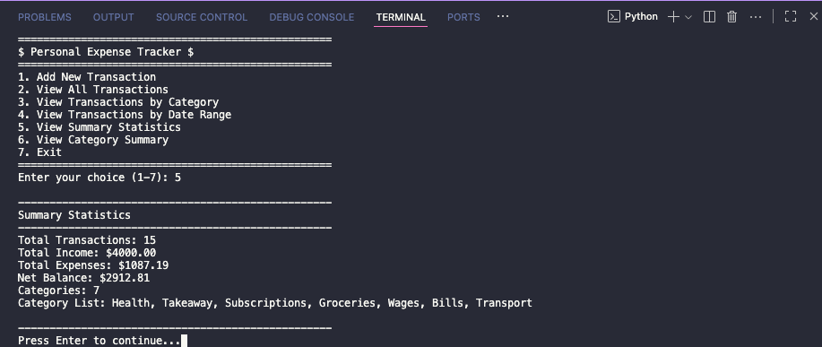
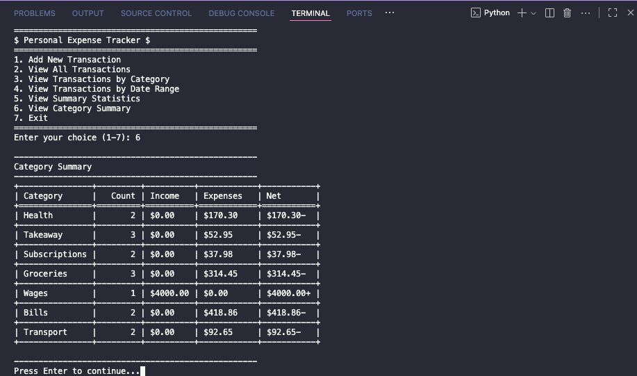

# Example Usage - A Visual Guide

This document extends the [README](./README.md) by providing visual examples of how to use the Personal Expense Tracker application.

**Please note:** The screenshots included in this document were taken on a MacOS instance of VS Code. If you are using a different operating system and/or code editor, your results may appear differently, and some keyboard shortcuts or terminal commands may need to be adjusted for Windows or Linux.

## Application Start Up

1. Create a virtual environment to contain the application and its installed dependencies.
   ```bash
   python3 -m venv .venv
   ```
2. Activate the virtual environment.
   ```bash
   source .venv/bin/activate
   ```
3. Install the required dependencies. These are contained within the `requirements.txt` file so you can install them all at once.
   ```bash
   pip install -r requirements.txt
   ```
4. Run the automated test suite to verify that all components and dependencies are functioning correctly.
   ```bash
   pytest -v
   ```
5. Start the application.
   ```bash
   python3 app.py
   ```


## 1. Add New Transaction

1. Select option #1 in the main menu to create a new income or expense transaction.

2. Follow the prompts in the terminal, and press "Enter" after typing each piece of information.

3. Once all requested information has been entered, "Press Enter to continue..." will appear. This confirms that the transaction has been successfully recorded.

4. Press "Enter" to return to the main menu.

5. To add additional transactions, repeat steps 1-4.



## 2. View All Transactions

1. Select option #2 in the main menu to view ALL saved transactions.

2. Transaction data is displayed in a table.

   - The table is sorted from newest to oldest.
   - The "Transaction Summary" below the table gives the total sum of all income and expense values, and the net balance (i.e., what is leftover after expenses have been subtracted from the income total).

3. Press "Enter" to return to the main menu.



## 3. View Transactions by Category

1. Select option #3 in the main menu to view all transactions by the category of your choice (categories are user-defined at the time you enter each new transaction).

2. The category can be selected by either typing the full name of the category, or by typing the associated number in the presented list.

3. All transactions that match that category will be displayed.

   - The table is sorted from newest to oldest.
   - The "Transaction Summary" below the table gives the total sum of all income and expense values, and the net balance (i.e., what is leftover after expenses have been subtracted from the income total).

4. Press "Enter" to return to the main menu.

5. To view additional transactions by category, repeat steps 1-4.



## 4. View Transactions by Date Range

1. Select option #4 in the main menu to view all transactions within a specific date range.

2. Follow the prompts in the terminal, and press "Enter" after typing each piece of information.

3. All transactions within the specified date range (inclusive of start and end dates) will be displayed.

   - The table is sorted from newest to oldest.
   - The "Transaction Summary" below the table gives the total sum of all income and expense values, and the net balance (i.e., what is leftover after expenses have been subtracted from the income total).

4. Press "Enter" to return to the main menu.

5. To view additional date ranges, repeat steps 1-4.



## 5. View Summary Statistics

1. Select option #5 in the main menu to view a high level summary of all transaction information.

2. Information displayed:

   - Total Transactions: A total count of all transactions.
   - Total Income: The sum total of all income transactions.
   - Total Expenses: The sum total of all expense transactions.
   - Net Balance: The remaining balance after expenses have been subtracted from income.
   - Categories: A total count of all user-defined transaction categories.
   - Category List: A list of all user-defined categories.

3. Press "Enter" to return to the main menu.



## 6. View Category Summary

1. Select option #6 in the main menu to view a high level summary of transactions by category.

2. Transactions are summarised by category (one category per row) with separate columns for the sum totals of income, expenses, and final net balance.

3. Press "Enter" to return to the main menu.


