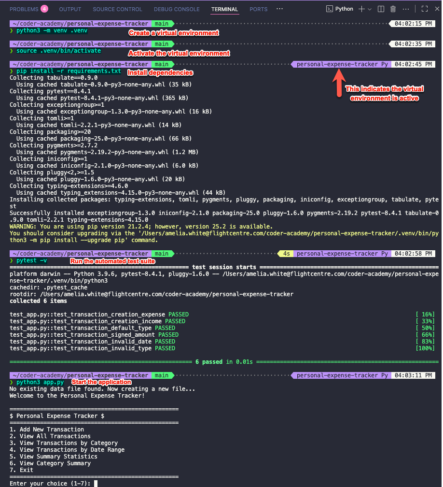

# Example Usage - A Visual Guide

This document extends the [README](./README.md) by providing visual examples of how to use the Personal Expense Tracker application.

**Please note:** The screenshots included in this document were taken on a MacOS instance of VS Code. If you are using a different operating system and/or code editor, your results may appear differently, and some keyboard shortcuts or terminal commands may need to be adjusted for Windows or Linux.

## Application Start Up

1. Create a virtual environment to contain the application and its installed dependencies.
   ```bash
   python3 -m venv .venv
   ```
2. Activate the virtual environment.
   ```bash
   source .venv/bin/activate
   ```
3. Install the required dependencies. These are contained within the `requirements.txt` file so you can install them all at once.
   ```bash
   pip install -r requirements.txt
   ```
4. Run the automated test suite to verify that all components and dependencies are functioning correctly.
   ```bash
   pytest -v
   ```
5. Start the application.
   ```bash
   python3 app.py
   ```



## 1. Add New Transaction

1. Selection option #1 in the main menu to create a new income or expense transaction.

2. Follow the prompts in the terminal, and press "Enter" after typing each piece of information.

3. Once all requested information has been entered, "Press Enter to continue..." will appear. This confirms that the transaction has been successfully recorded.

4. To add additional transactions, repeat steps 1-3.


